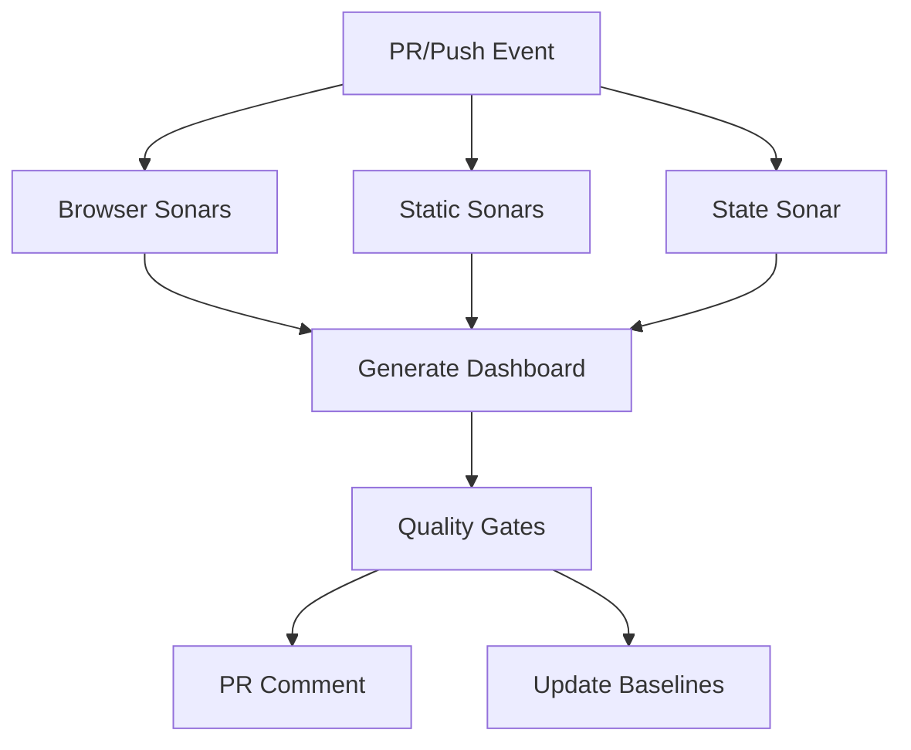

# Unified Sonar Suite - CI/CD Integration Guide

**Agent Kilo - CI/CD Automation Architect**

---

## 📋 Table of Contents

1. [Overview](#overview)
2. [Quick Start](#quick-start)
3. [GitHub Actions Workflow](#github-actions-workflow)
4. [Local Testing](#local-testing)
5. [Quality Gates](#quality-gates)
6. [PR Comments](#pr-comments)
7. [Badge Generation](#badge-generation)
8. [Multi-Team Support](#multi-team-support)
9. [Troubleshooting](#troubleshooting)
10. [Time Budget Analysis](#time-budget-analysis)

---

## 🎯 Overview

The Unified Sonar Suite CI/CD automation provides:

- **Automated testing** on every PR and push to main
- **6 parallel sonars** analyzing different aspects of your codebase
- **Quality gates** with regime-based thresholds
- **Beautiful PR comments** with SHM score and insights
- **Automatic baseline updates** on successful main branch pushes
- **Status badges** for your README
- **<5 minute execution time** (parallel job strategy)

### Sonar Suite Components

| Sonar | Purpose | Runtime | Type |
|-------|---------|---------|------|
| **UX Sonar** | Performance, accessibility, responsiveness | ~60s | Browser |
| **Design Sonar** | Visual harmony, consistency, breathability | ~45s | Browser |
| **Code Sonar** | Complexity, duplication, maintainability | ~30s | Static |
| **Semantic Sonar** | Architecture, coupling, dependencies | ~45s | Static |
| **Journey Sonar** | User behavior, frustration detection | ~90s | Browser |
| **State Sonar** | State machine complexity, impossible states | ~30s | Browser |

---

## 🚀 Quick Start

### 1. Prerequisites

```bash
# Install dependencies
npm install

# Verify Playwright is installed
npx playwright install chromium
```

### 2. Run Locally

**Linux/Mac:**
```bash
npm run sonar:all
```

**Windows:**
```bash
npm run sonar:all:windows
```

**Individual sonars:**
```bash
npm run test:ux-sonar
npm run test:design-sonar
npm run test:code-sonar
npm run test:semantic-sonar
npm run test:journey-sonar
npm run test:state-sonar
```

### 3. View Results

After running, check:
- **Dashboard:** `tests/ux-sonar/reports/sonar-dashboard.html`
- **Quality Gates:** `tests/ux-sonar/reports/quality-gates-report.md`
- **Baselines:** `tests/ux-sonar/baselines/*.json`

---

## ⚙️ GitHub Actions Workflow

The workflow (`.github/workflows/sonar-suite.yml`) runs automatically on:
- Pull requests to `main` or `develop`
- Pushes to `main` branch
- Manual workflow dispatch

### Workflow Jobs



**Job 1: Browser Sonars** (UX + Design + Journey)
- Starts dev server
- Runs 3 browser-based sonars in sequence
- ~3 minutes total

**Job 2: Static Sonars** (Code + Semantic)
- No dev server needed
- Analyzes codebase structure
- ~1 minute total

**Job 3: State Sonar**
- Analyzes state machines
- ~30 seconds

**Job 4: Dashboard Generation**
- Aggregates all sonar results
- Generates unified HTML dashboard
- Calculates System Health Metric (SHM)

**Job 5: Quality Gates**
- Applies regime-based thresholds
- Generates gate report
- Exits with code 1 if gates fail

**Job 6: PR Comment** (PRs only)
- Posts beautiful comment with results
- Updates existing comment if found
- Includes SHM badge, critical issues, and wins

**Job 7: Update Baselines** (main branch only)
- Updates baselines if gates passed
- Commits to repo with `[skip ci]`

### Artifacts

All jobs upload artifacts to GitHub Actions:

| Artifact | Contents | Retention |
|----------|----------|-----------|
| `browser-sonar-results` | Baselines + reports from UX/Design/Journey | 30 days |
| `static-sonar-results` | Baselines + reports from Code/Semantic | 30 days |
| `state-sonar-results` | Baselines + reports from State | 30 days |
| `sonar-dashboard` | Unified HTML dashboard + JSON | 90 days |
| `quality-gate-results` | Gate report (MD + JSON) | 90 days |
| `pr-comment` | Generated PR comment markdown | 30 days |

---

## 🏠 Local Testing

### Full Suite

Run all sonars, generate dashboard, and apply quality gates:

**Linux/Mac:**
```bash
chmod +x tests/ux-sonar/run-all-sonars.sh
npm run sonar:all
```

**Windows:**
```bash
npm run sonar:all:windows
```

### Step-by-Step

Run each phase manually:

```bash
# Phase 1: Browser sonars (requires dev server)
npm run dev &  # Start in background
npm run test:ux-sonar
npm run test:design-sonar
npm run test:journey-sonar

# Phase 2: Static sonars
npm run test:code-sonar
npm run test:semantic-sonar

# Phase 3: State sonar
npm run test:state-sonar

# Phase 4: Generate dashboard
npm run generate:dashboard

# Phase 5: Apply quality gates
npm run quality:gates

# Phase 6: Generate PR comment (optional)
npm run generate:pr-comment

# Phase 7: Generate badges (optional)
npm run generate:badges
```

### Output Locations

```
tests/ux-sonar/
├── baselines/
│   ├── global-baseline.json
│   ├── code_asymmbill.json
│   ├── semantic_asymmbill.json
│   ├── design__.json
│   └── journey__*.json
├── reports/
│   ├── sonar-dashboard.html          # Main dashboard
│   ├── system-health-report.json     # SHM data
│   ├── quality-gates-report.md       # Gate results
│   ├── quality-gates-report.json
│   └── badges.md                     # Generated badges
```

---

## 🚪 Quality Gates

Quality gates apply regime-based thresholds to ensure code quality.

### Gate Thresholds

| Regime | SHM Threshold | Individual Sonar | Critical Issues |
|--------|---------------|------------------|-----------------|
| **Exploration** | ≥ 70% (warning: 60%) | ≥ 60% | ≤ 3 |
| **Optimization** | ≥ 80% (warning: 70%) | ≥ 75% | ≤ 2 |
| **Stabilization** | ≥ 85% (hard requirement) | ≥ 85% | 0 |

### Gate Results

Gates can return three statuses:

- **✅ PASSED:** All gates met or exceeded
- **⚠️ WARNING:** Some gates below target but above minimum
- **❌ FAILED:** One or more gates critically low

### Recommendations

The quality gates script generates actionable recommendations:

```bash
npm run quality:gates
```

Example output:
```
🎯 Focus on improving lowest-scoring sonars to raise SHM
🔧 Design: Review and address critical issues identified in sonar report
📊 Increase test coverage in stabilization regime (critical paths)
```

---

## 💬 PR Comments

Automated PR comments provide at-a-glance insights.

### Comment Structure

```markdown
## 🎯 Sonar Suite Results

 🟢

**Overall Status:** ✅ PASSED
**Regime Distribution:** 🔍 30% | ⚙️ 20% | ✅ 50%
**Trend:** 📈 +5.2% from baseline

---

### 🚨 Critical Issues (0)
[None - all systems healthy!]

### ⚠️ Warnings (2)
- **Design:** Contrast score below target
- **Code:** Duplication detected in 3 files

### ✅ Wins
- 🎉 **UX:** 60 FPS on all pages!
- ✨ **Semantic:** Zero circular dependencies!
- 🚀 **Journey:** 100% task success rate!

### 📊 Sonar Scores
| Sonar | Score | Status | Key Metric | Delta |
|-------|-------|--------|------------|-------|
| **UX** | 0.92 | ✅ healthy | FPS: 60 | 🟢 ▲0.05 |
| **Design** | 0.78 | ⚠️ warning | Harmony: 78 | 🔴 ▼0.02 |
...

### 💡 Recommendations
- ⚡ Design: Optimization opportunity - score below 0.75
- ⚙️ Optimization regime: Refine existing features
```

### Customization

Edit `tests/ux-sonar/pr-comment-generator.ts` to customize:
- Number of issues/wins shown
- Badge style
- Recommendation logic

---

## 🏷️ Badge Generation

Generate README badges for your project:

```bash
npm run generate:badges
```

### Badge Types

**System Health Metric (SHM)**
```markdown

```

**Regime**
```markdown

```

**CI Status** (GitHub Actions)
```markdown

```

**Last Run**
```markdown

```

**Trend**
```markdown

```

### Add to README

Copy the generated section from `tests/ux-sonar/reports/badges.md` to your README:

```markdown
## 🎯 Sonar Suite Status

  

 

**System Health Metric (SHM):** 82% - Optimization Regime

📊 [View Full Dashboard](link)
```

---

## 👥 Multi-Team Support

The Sonar Suite supports team-specific baselines and weights.

### Team Configuration

Teams are defined in `tests/ux-sonar/baselines/`:
- `global-baseline.json` - Default for all teams
- `team-ux-baseline.json` - UX team overrides
- `team-backend-baseline.json` - Backend team overrides
- `team-qa-baseline.json` - QA team overrides

### Team-Specific Weights

**Example: UX Team**
```json
{
  "teamId": "team-ux",
  "weights": {
    "ux": 0.30,      // Higher weight on UX
    "design": 0.30,  // Higher weight on Design
    "code": 0.10,
    "semantic": 0.10,
    "journey": 0.10,
    "state": 0.10
  }
}
```

**Example: Backend Team**
```json
{
  "teamId": "team-backend",
  "weights": {
    "ux": 0.10,
    "design": 0.10,
    "code": 0.30,      // Higher weight on Code
    "semantic": 0.30,  // Higher weight on Semantic
    "journey": 0.10,
    "state": 0.10
  }
}
```

### Using Team Baselines

Set the `TEAM_ID` environment variable:

```bash
# Local
TEAM_ID=team-ux npm run sonar:all

# GitHub Actions
env:
  TEAM_ID: team-ux
```

---

## 🔧 Troubleshooting

### Issue: Dev Server Not Starting

**Symptoms:** Browser sonars fail with "Could not connect to localhost:3000"

**Solution:**
```bash
# Start dev server manually
npm run dev

# In another terminal, run sonars
npm run test:ux-sonar
```

### Issue: Playwright Browsers Not Installed

**Symptoms:** "Executable doesn't exist at ..."

**Solution:**
```bash
npx playwright install chromium --with-deps
```

### Issue: Quality Gates Failing

**Symptoms:** "Quality gates FAILED - exiting with code 1"

**Solution:**
1. Check `tests/ux-sonar/reports/quality-gates-report.md`
2. Review failing sonars
3. Address critical issues
4. Re-run: `npm run quality:gates`

### Issue: Dashboard Not Generating

**Symptoms:** "System health data not found"

**Solution:**
```bash
# Ensure all sonars have run
npm run test:sonar-suite

# Generate dashboard
npm run generate:dashboard

# Check baselines exist
ls tests/ux-sonar/baselines/
```

### Issue: Baselines Missing

**Symptoms:** "Baseline not found for sonar X"

**Solution:**
```bash
# Run the sonar to create baseline
npm run test:ux-sonar  # (or whichever is missing)

# Or run full suite
npm run sonar:all
```

### Issue: GitHub Actions Permissions

**Symptoms:** PR comment fails with "Resource not accessible by integration"

**Solution:**

Add permissions to workflow:
```yaml
permissions:
  contents: read
  pull-requests: write
  actions: read
```

---

## ⏱️ Time Budget Analysis

Target: **< 5 minutes** total execution time

### Job Timing Breakdown

| Job | Tasks | Est. Time | Parallel |
|-----|-------|-----------|----------|
| **Browser Sonars** | UX + Design + Journey + server startup | ~3:00 | Job 1 |
| **Static Sonars** | Code + Semantic | ~1:15 | Job 2 |
| **State Sonar** | State machine analysis | ~0:30 | Job 3 |
| **Dashboard** | Aggregate results, generate HTML | ~0:20 | After 1-3 |
| **Quality Gates** | Apply thresholds, generate report | ~0:10 | After 4 |
| **PR Comment** | Generate + post comment | ~0:10 | After 5 |
| **Update Baselines** | Commit to repo | ~0:15 | After 5 |

**Total (parallel):** ~4:30 (under budget!)

### Optimization Tips

1. **Cache npm modules** - Saves ~30s per run
2. **Cache Playwright browsers** - Saves ~60s on cold runs
3. **Run static sonars in parallel** - Already implemented
4. **Skip baselines on PRs** - Only update on main
5. **Use `continue-on-error: true`** - Don't block on warnings

---

## 📊 Integration Success Metrics

After integration, track these metrics:

### Quality Metrics
- **SHM Score:** Target > 85% (stabilization)
- **Critical Issues:** Target 0
- **Regime Distribution:** Target 50% stabilization, 30% exploration, 20% optimization

### DevOps Metrics
- **CI/CD Runtime:** Target < 5 minutes
- **PR Comment Latency:** Target < 10 seconds
- **Baseline Update Frequency:** Track commits per week

### Developer Experience
- **PR Feedback Clarity:** Survey developers on comment usefulness
- **False Positive Rate:** Track issues marked as "not applicable"
- **Actionability:** % of recommendations acted upon

---

## 🎯 Next Steps

1. **Review workflow file:** `.github/workflows/sonar-suite.yml`
2. **Run local test:** `npm run sonar:all`
3. **Review dashboard:** Open `tests/ux-sonar/reports/sonar-dashboard.html`
4. **Commit workflow:** Push to GitHub and create test PR
5. **Monitor results:** Check PR comments and artifacts
6. **Tune thresholds:** Adjust quality gates in `quality-gates.ts`
7. **Add badges:** Update README with generated badges

---

## 📞 Support

- **Documentation:** This file
- **Workflow:** `.github/workflows/sonar-suite.yml`
- **Scripts:** `tests/ux-sonar/*.ts`
- **Issues:** Check troubleshooting section above

---

**Generated by Agent Kilo - CI/CD Automation Architect**

*One PR, complete analysis - automate the entire Sonar Suite!* ⚙️✨
