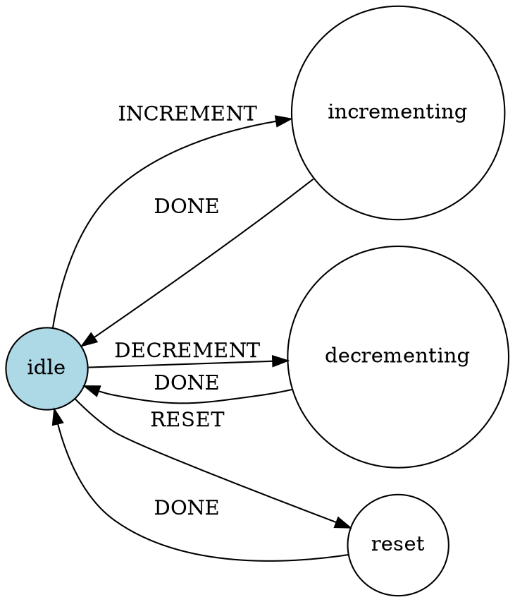

╔════════════════════════════════════════════════════════════════════════════╗
║                     STATE SONAR ANALYSIS REPORT                            ║
╚════════════════════════════════════════════════════════════════════════════╝

Route: /counter
Timestamp: 2025-10-05T00:29:16.062Z
SMT (State Manageability Threshold): 4.58
Regime: Stabilization

================================================================================

## EXECUTIVE SUMMARY

State Machine Architecture: Grade A (100/100)

Total State Machines: 1
Total States: 4
Total Transitions: 6
Parallel States: 1

State Manageability Threshold (SMT): 4.58
Explosion Factor: 1.00
Transition Coverage: 100%

✅ SMT is within manageable range

Impossible States: 0
Race Conditions: 0

Regime: State Machine Detected

Overall Grade: A (Score: 100/100)

================================================================================

## STATE MACHINE DIAGRAMS

### 1. counter (xstate)

**ASCII Diagram:**
```
State Machine: counter
Initial State: idle

  [*►] idle
        -------> INCREMENT --> incrementing
        -------> DECREMENT --> decrementing
        -------> RESET --> reset

  [ ] incrementing
        -------> DONE --> idle

  [ ] decrementing
        -------> DONE --> idle

  [ ] reset
        -------> DONE --> idle

Legend:
  [*]   = Initial state
  [►]   = Current state
  [*►]  = Initial & current
  [!]   = Missing or problematic transition
```

**DOT Format (for Graphviz):**


**States:** 4
**Transitions:** 6
**Current State:** idle

================================================================================

## METRICS

| Metric                           | Value        | Status |
|----------------------------------|--------------|--------|
| SMT (Manageability Threshold)    | 4.58        | 🟢 Good |
| Explosion Factor                 | 1.00        | 🟢 Normal |
| Total States                     | 4           | 🟢 Normal |
| Total Transitions                | 6      | 🟢 Normal |
| Parallel States                  | 1        | 🟢 Normal |
| Transition Coverage              | 100%           | 🟢 Perfect |
| Impossible States                | 0           | 🟢 None |
| Race Conditions                  | 0           | 🟢 None |

**SMT Threshold Guide:**
- SMT < 5: Simple, manageable state machine ✅
- SMT 5-8: Moderate complexity, watch for growth ⚠️
- SMT 8-10: High complexity, consider refactoring 🟡
- SMT > 10: Unmanageable, urgent refactoring needed 🔴

================================================================================

## ISSUES

✅ No issues detected! State machine architecture looks clean.

================================================================================

## RECOMMENDED IMPROVEMENTS

1. ✅ State architecture looks good! Consider these enhancements:
2.    - Add state machine visualizations to documentation
3.    - Implement state machine testing with @xstate/test
4.    - Monitor state transitions in production
5.    - Document state machine behavior and edge cases

================================================================================


================================================================================

## PRAISE MODE 🎉

✅ Zero impossible states detected! State machine is well-defined.
✅ No race conditions found! State transitions are properly managed.
✅ Clean state architecture! No excessive prop drilling detected.
✅ 100% transition coverage! All states have proper event handlers.

================================================================================

## STATE EXPLOSION ANALYSIS

**Explosion Risk:** 46%

✅ **LOW RISK:** State complexity is well-managed
   - Current architecture is sustainable

**State Explosion Growth Rate:**
   - Current: O(n)
   - Adding 1 parallel state: O(2n)

================================================================================

## FINAL RECOMMENDATIONS

🏆 **Excellent state machine architecture!**

Keep it up:
  - Continue using XState or similar state machine libraries
  - Document state machine behavior
  - Add visual state diagrams to your docs
  - Implement state machine testing

**Resources:**
  - XState Docs: https://xstate.js.org/docs/
  - State Machine Testing: https://xstate.js.org/docs/packages/xstate-test/
  - XState Visualizer: https://stately.ai/viz