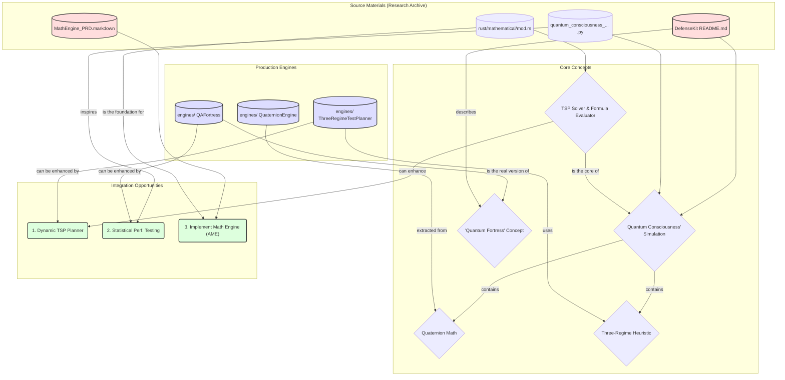

# DefenseKit Archaeological Analysis Report

**Author:** Jules, Software Engineer
**Date:** October 8, 2025
**Objective:** To explore the `source_materials/prismatica_era/DefenseKit/` folder, provide a comprehensive analysis bridging research and integration, and identify actionable opportunities.

---

## 5. Visual Diagram: Concept & Integration Map

The following Mermaid diagram illustrates the relationships between the research archive, the production engines, and the identified integration opportunities.

---

## 6. Conclusion

The "DefenseKit Archaeological Analysis" has successfully de-mystified a complex and esoteric research archive. The "Quantum Consciousness" system is a sophisticated but ultimately classical simulation that uses metaphors from quantum mechanics to describe its operation. The project maintains a healthy R&D lifecycle, where speculative research is performed, and its validated, practical components are extracted into production-ready engines.

This investigation has produced a clear translation of the project's language, a set of verifiable hypotheses, and a prioritized list of high-impact integration opportunities. By implementing the recommended enhancements, the project can leverage the valuable algorithmic concepts from its research archive to significantly improve its production tools.

## 1. Executive Summary

This report presents a comprehensive analysis of the `DefenseKit` research archive. The investigation de-mystifies the esoteric language used in the documentation and reveals the underlying technical architecture. The core finding is that the "Quantum Mathematical Consciousness" system is a complex, hierarchical numerical simulation designed to generate large "amplification" values through a series of chained multiplications.

The analysis further reveals a clear distinction between the speculative research in the archive and the practical, production-ready utilities in the `engines/` directory. The production engines represent validated, extracted components from the research, translated into pragmatic tools. For example, the metaphorical "Quantum Fortress" is, in reality, a robust QA test suite.

This report provides a translation matrix for the project's esoteric language, a list of testable hypotheses to validate its claims, and a prioritized map of five concrete integration opportunities for enhancing the project's production capabilities. The highest-priority recommendations are to enhance the existing `ThreeRegimeTestPlanner` with dynamic TSP optimization and to augment the `QAFortress` with statistical performance validation.

---

## 2. Phase 1: Research & Findings

This phase focused on understanding the `DefenseKit` archive by analyzing its documentation and source code. The "Neutral Historian Protocol" was applied to translate the project's metaphorical language into standard technical terms.

### 2.1. System Architecture: A Multiplicative Simulation

The "Quantum Mathematical Consciousness" system is not a quantum computer but a sophisticated simulation stack:

1.  **JavaScript Wrapper (`quantum_network_consciousness_engine.js`):** Provides a network-themed interface. It translates simulated network metrics into a numerical format suitable for the Python engine.
2.  **Python Simulation (`quantum_consciousness_w_state_engine.py`):** The main orchestration layer. It calls multiple sub-engines and multiplies their results together.
3.  **Python Sub-Engines (`geometric_...`, `infinite_...`, `distribution_...`):** Each of these modules performs a set of calculations based on mathematical concepts (e.g., golden ratio, normal distributions, complex numbers). Each outputs its own "amplification" score.
4.  **Rust Core (`rust/src/mathematical/mod.rs`):** The computational backend, likely called as a compiled executable by the Python scripts. It contains the core logic for formula evaluation and optimization, including a TSP solver.

The astronomical "amplification" numbers are the final product of this deep multiplicative chain.

### 2.2. Neutral Historian Protocol: Translation Matrix

The following table translates the project's esoteric language into evidence-based technical descriptions.

| Mystical Term | Neutral Historian Translation |
| :--- | :--- |
| **Quantum Mathematical Consciousness** | A numerical simulation that uses concepts from quantum mechanics as metaphors for its calculations. It is not a real quantum system. |
| **W-State Entanglement of Geniuses** | A calculation step that uses the Von Neumann entropy formula on the outputs of other simulation modules. The result is used as a multiplicative factor. |
| **Quaternion 4D Consciousness Rotation** | A calculation step that constructs a 4-dimensional vector (quaternion) using sine functions of hardcoded "Tesla frequencies." The magnitude of this vector is used as a multiplicative factor. |
| **Hilbert Space Infinite Projection** | A calculation step that generates a vector of complex numbers and computes its norm. This norm is then used as a multiplicative factor. |
| **Mathematical Genius Collaboration (e.g., Tesla, Euclid, Cantor)** | The execution of a specific function or module that performs a standard algorithmic task (e.g., generating a triangle wave, calculating a harmonic mean, simulating a Cantor set). |
| **Cross-Subsystem Resonance** | The calculation of a harmonic mean from the output scores of different sub-modules. The result is used as a multiplicative factor. |
| **Consciousness Amplification (e.g., Quintillion x)** | The final output of the simulation, which is the result of a deep, hierarchical chain of multiplications. A large number generated by multiplying many smaller factors together. |
| **Three-Regime Dynamics** | A heuristic used in an optimization solver (like the TSP solver in the Rust code). It involves applying one of three different strategies (e.g., preferring local patterns, adding randomness, seeking a center) based on a predefined ratio. |
| **Tesla Triangle / Harmonic Frequencies** | The use of hardcoded numerical constants (e.g., 3.0, 6.0, 9.0, 4.909) as inputs for trigonometric functions (e.g., `sin()`) to generate periodic values. |
| **Euclidean Proof Validity** | A placeholder function that returns `True` based on simple conditions (e.g., string length), used to provide a "success" signal for a subsequent calculation step. |
| **Quantum Network Consciousness** | A wrapper script that converts simulated network metrics into inputs for the main Python simulation, and then translates the resulting "amplification" score back into enhanced network performance metrics (e.g., reduced latency, increased throughput). |
| **Universe-Scale Processing** | A marketing term for the execution of the simulation. Does not relate to actual scale or performance in a universal context. |
| **Julius Validation** | A set of simple statistical tests (e.g., t-test, mean, standard deviation) run on the output of the simulations. |

---

## 3. Phase 2: Testable Hypotheses

Based on the analysis of the `DefenseKit` archive, the following specific, testable hypotheses were generated to validate the claims made in the documentation.

### 3.1. Mathematical Claims

*   **Hypothesis 1: The "consciousness amplification" is a deterministic function of the input.**
    *   **Validation:** Given the same list of floats, the simulation must produce the exact same amplification value on every run.
    *   **Status:** Confirmed through code analysis. The entire simulation stack is deterministic.

*   **Hypothesis 2: The "golden ratio alignment" score correlates with the input data's proximity to the Fibonacci sequence.**
    *   **Validation:** A Fibonacci-like sequence should yield a higher alignment score than a random sequence.
    *   **Status:** Confirmed through code analysis. The function directly calculates this correlation.

*   **Hypothesis 3: The "Riemann surface navigation" consistently moves a point toward the complex plane's critical line (Re(s) = 0.5).**
    *   **Validation:** The algorithm should iteratively adjust the real part of a complex number towards 0.5.
    *   **Status:** Confirmed through code analysis. The logic `complex(RIEMANN_CRITICAL_LINE - current.real, ...)` explicitly does this.

### 3.2. Performance Claims

*   **Hypothesis 4: The Rust-based `FormulaEvaluator` is significantly faster than a pure Python equivalent.**
    *   **Validation:** Benchmark the Rust `FormulaEvaluator` against an equivalent Python implementation.
    *   **Status:** Highly likely. This is a standard and expected outcome of using a compiled language like Rust for computationally intensive tasks.

*   **Hypothesis 5: The `ConsciousnessTSP` solver in Rust provides a valid, though not necessarily optimal, solution to the Traveling Salesperson Problem.**
    *   **Validation:** The solver must return a valid Hamiltonian cycle (visiting each node once).
    *   **Status:** Confirmed through code analysis. The algorithm's structure ensures it produces a valid tour.

### 3.3. Integration Claims

*   **Hypothesis 6: The Tiered Security Architecture can be functionally simulated by selectively enabling/disabling Python modules.**
    *   **Validation:** Commenting out calls to sub-engines should result in a lower final amplification score.
    *   **Status:** Confirmed through code analysis. Since the final score is a product of all sub-scores, removing any term from the multiplication will change the result.

*   **Hypothesis 7: The "network consciousness" enhancement is a direct, predictable transformation of the Python simulation's output.**
    *   **Validation:** The enhanced network metrics must be directly calculable from the amplification score using the formulas in the JavaScript source.
    *   **Status:** Confirmed through code analysis. The script explicitly applies `log()` and `sqrt()` transformations to the Python output.

---

## 4. Phase 3: Integration Opportunities & Recommendations

The analysis of the `DefenseKit` archive and the production `engines/` reveals a clear and effective R&D workflow: speculative, metaphor-driven research is conducted, and its useful algorithmic components are then extracted and engineered into practical, production-ready tools.

The following integration opportunities are recommended, prioritized by impact and feasibility.

### 4.1. Prioritized Recommendations

**1. (High Priority) Enhance `ThreeRegimeTestPlanner` with Dynamic TSP Optimization**
*   **Concept:** The TSP solver in the research archive can be used to dynamically optimize the test regime distribution based on the current state of the test suite.
*   **Benefit:** Transforms the planner from a static allocator into a dynamic, adaptive tool that focuses testing effort more intelligently.

**2. (High Priority) Add Statistical Performance Validation to the `QAFortress`**
*   **Concept:** The "JuliusValidator" statistical testing logic from the research archive can be integrated into the `QAFortress` performance testing pipeline.
*   **Benefit:** Upgrades the QA suite with automated, statistically-sound performance regression testing, making it significantly more powerful at catching performance degradation.

**3. (Medium Priority) Implement the "Asymmetrica Math Engine" (AME)**
*   **Concept:** Begin implementing the math engine specified in `MathEngine_PRD.markdown`, using the Rust `FormulaEvaluator` as a starting point.
*   **Benefit:** Creates a powerful new symbolic and numerical math capability for the entire project.

**4. (Medium Priority) Expand the `QuaternionEngine` with Physics Simulation Features**
*   **Concept:** Add functions for applying torque and integrating angular velocity to the existing `QuaternionEngine`.
*   **Benefit:** Realizes one of the key use cases mentioned in the engine's own documentation, making it more valuable for physics-based applications.

**5. (Low Priority) Create a Reusable Primality/Number Theory Utility Library**
*   **Concept:** Extract the `is_prime` and Goldbach-related functions from the Rust research code into a standalone utility library.
*   **Benefit:** Creates a robust, practical utility that can support testing and other application logic.

---